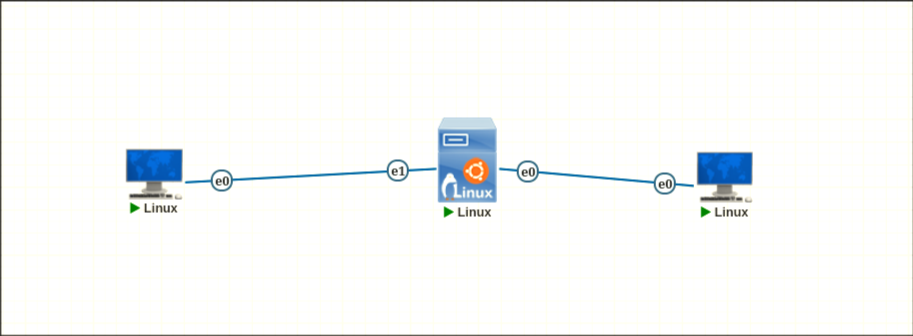
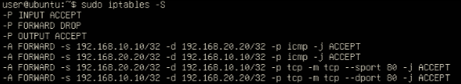
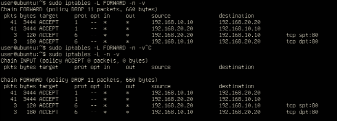

# Lab 10 - Firewall de Pacotes com `iptables`

## Objetivo 

Implementar um firewall de pacotes em uma máquina Linux no PNetLab, posicionada entre duas máquinas Linux básicas - preferencialmente Linux Tinycore-6.4 - aplicando regras com iptables para controlar o tráfego entre duas redes distintas com base em endereço IP, protocolo e porta.

## Topologia

> Não dexei labels mostrando o IP das máquinas mas o host da esquerda tem o IP 192.168.10.10/24 e o da direita 192.168.20.20/24 com o server sendo gateway das duas subredes com final .1 

## Configuração do IPTABLES

## Questões para análise

- O que caracteriza um firewall de pacotes?

> É um firewall que analisa o pacote individualmente. Podendo dropá-lo ou aceitá-lo pelas informações dele.

- Quais campos do pacote foram usados nas regras deste laboratório?

> Endereço de IP de origem e destino, protocolo e portas de origem e destino.

- Por que foi necessário ativar o IP forwarding no Linux?

> Por que por padrão os sistemas operacionais fazem com que os pacotes que não tem destino ao endereço IP da máquina sejam descartados. Ativando, nós conseguimos fazer um pequeno papel de roteador.

- Qual é a função da cadeia FORWARD no iptables?

> Lidar com o tráfego de pacotes com destino a outros dispostivos.

- Por que o tráfego não permitido foi bloqueado mesmo sem regras específicas para todos os protocolos?

> Por que o FORWARD tem por padrão a política de descarte. Se não tivermos uma política que aceite algum tipo de pacote, ele vai ser descartado.

- Qual a diferença entre permitir HTTP e permitir ICMP?

> Para permitir HTTP, precisamos permitir o TCP (que é onde o HTTP trabalha por cima) e a porta que o HTTP usa (80). Para permitir o ICMP, só especificamos -p icmp. 

- O que muda quando a política padrão da cadeia FORWARD é DROP?

> O firewall bloqueia tudo a não ser que tenha algo especificado para não bloquear.

- Por que esse laboratório ainda não é considerado um firewall stateful?

> Por que especificamos a rota de ida e volta do pacote. Em firewalls stateful, isso não seria necessário.

- Qual a importância da ordem das regras no iptables?

> O IPTABLES lê de forma sequencial, de cima para baixo. Assim que uma regra é executada, acabou.

- Quais vantagens práticas surgem ao usar hosts Linux básicos no lugar de VPCs neste laboratório?

> VPCs somente conseguem fazer o trabalho de ping e tracert. Com hosts linux, conseguimos criar serviços HTTP, por exemplo. Também podemos usar ferramentas mais completas para ver o que está acontecendo dentro da rede, como o netcat.

- Qual a diferença entre bloquear o ping com sysctl e bloquear ICMP com iptables?

> Com sysctl, eu modifico as configurações da minha máquina, não de outras máquinas. Com o firewall, eu posso bloquear os pacotes que tem destino a outras máquinas, se o pacote passar por mim primeiramente, é claro.

# FIM
