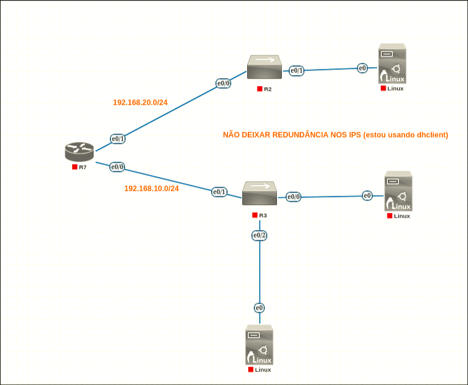
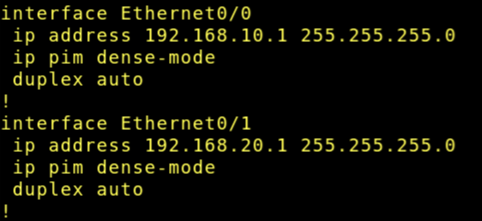
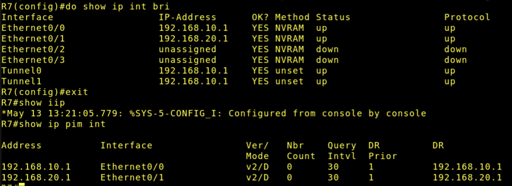
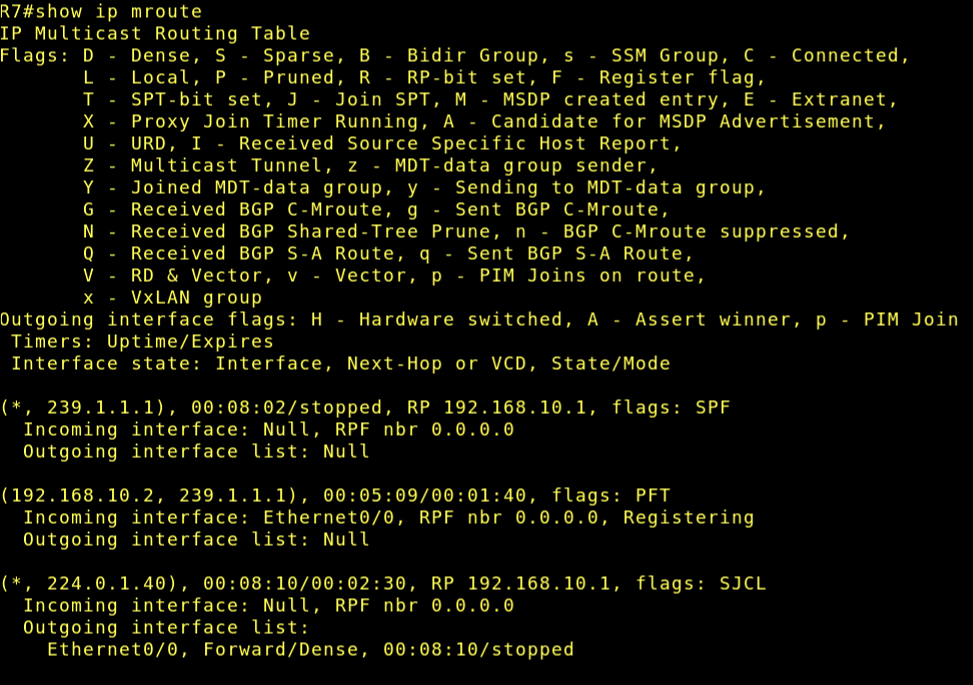
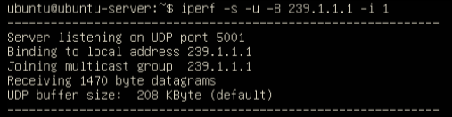
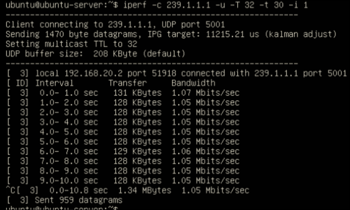

# Laboratório 03 - PIM-DM em topologia controlada

Implementação inicial de multicast IP com PIM-DM em uma topologia pequena e controlada no PNetLab, validando a formação básica do encaminhamento multicast entre uma origem e um receptor em duas LANs distintas.

## Justificativa

Esta prática introduz o aluno ao roteamento multicast em ambiente controlado. Após a configuração básica de interfaces e conectividade IP em laboratório anterior, o estudante passa a observar:

- tráfego unicast como base para o funcionamento do multicast;
- habilitação de multicast routing no roteador;
- ativação do PIM Dense Mode (PIM-DM);
- formação da tabela de rotas multicast;
- encaminhamento de tráfego multicast entre redes diferentes.


## Topologia proposta



> Todos os PCs obtem IP por DHCP, A partir do endereço 192.168.x.2

> Em cada switch é usado o comando *no ip igmp snooping

## Montagem do cenário no PNetLab

### Dispositivos usados

- Imagem de roteador Cisco compatível: IOL L3-ADVENTERPRISEK9-M-15.4-2T.bin

- 2 nó Ethernet Switch compatível: L2-ADVENTERPRISEK9-M-15.2-IRON-20151103.bin

- 3 imagem linux (ubuntu server) para os hosts 
   - Pacote iperf3 em cada host
   - dhclient

### Configuração do roteador




Configurações adicionais:

```
ip multicast-routing
```


### Verificação do roteador





## Geração de tŕafego nos hosts

### Receptor

Para o receptor, usaremos o seguinte comando:

```sh
iperf -s -u -B 239.1.1.1 -i 1
```


| Parâmetro     |       O que faz         |
|---------------| ------------------------|
| -s            | Modo servidor           |
| -u            | UDP                     |
| -B 239.1.1.1  | Bind no grupo 239.1.1.1 |
| -i            | Segundos de reports     |



### Transmissor

Para o host origem, usaremos:

```sh
iperf -c 239.1.1.1 -u -T 32 -t 30 -i 1
```

| Parâmetro   | O que faz     |
|--------------- | ---------- |
| -c   | Modo cliente         |
| -u   | UDP                  |
| -T   | TTL                  |
| -t   | Tempo de transmissão |




Após isso, o servidor recebe os pacotes.


## Questões para análise


- Por que o PIM é considerado independente do protocolo de roteamento unicast?

> Porque ele usa qualquer tabela de endereçamento IP disponível


- Qual a diferença entre tráfego unicast e multicast neste cenário?

> Ao invés do destino do iperf ser apenas um host, usaando multicast nós pegamos um grupo, permitindo que vários hosts consigam receber pacotes do transmissor sem problemas. Otimizando assim o consumo de banda.

- Qual a função do comando ip multicast-routing?

> Apenas habilita tráfego multicast no roteador. Permitindo que o roteador encaminhe pacotes multicast entre interfaces.

- Por que o PIM-DM é uma boa escolha para uma primeira atividade prática?

> Pois exige pouca configuração e é fácil de observar o flooding multicast 

- O que a tabela show ip mroute revela sobre o encaminhamento multicast?

> Revela os grupos multicast ativos, estado do PIM, qual interface ele deve chegar (atráves do Reverse Path Forwarding) e de onde o tráfego está vindo.

# FIM
