# Laboratório 05 - Roteamento Dinâmico com RIP e OSPF

## Objetivo 

Configurar e validar o roteamento dinâmico em uma topologia com três roteadores, comparando o funcionamento dos protocolos RIP e OSPF em um mesmo cenário.

Ao final deste laboratório, devemos entender como:

- configurar interfaces IP em roteadores Cisco;
- ativar roteamento dinâmico com RIP;
- ativar roteamento dinâmico com OSPF;
- verificar tabelas de roteamento;
- validar conectividade entre redes remotas;
- comparar as características básicas de RIP e OSPF.

## Topologia 

A topologia possui três roteadores interligando três unidades:

- R1 - Rio de Janeiro
- R2 - São Paulo
- R3 - Belo Horizonte


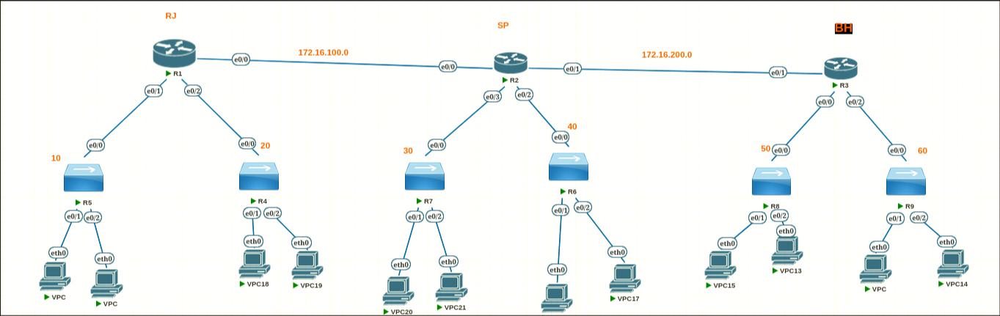

> Cada roteador administra 2 redes, sendo o modelo de subrede utilizada no laboratório o de 172.16.x.0/24, e cada número ao lado do switch significa a rede correspondente.

## Endereçamento dos roteadores

- RJ <-> SP

| RJ | SP |
| -------------- | --------------- |
| 172.16.100.1 | 172.16.100.2 |

- SP <-> BH

| SP | BH |
| -------------- | --------------- |
| 172.16.200.1 | 172.16.200.2 |

## Verificação inicial sem roteamento dinâmico

### R1

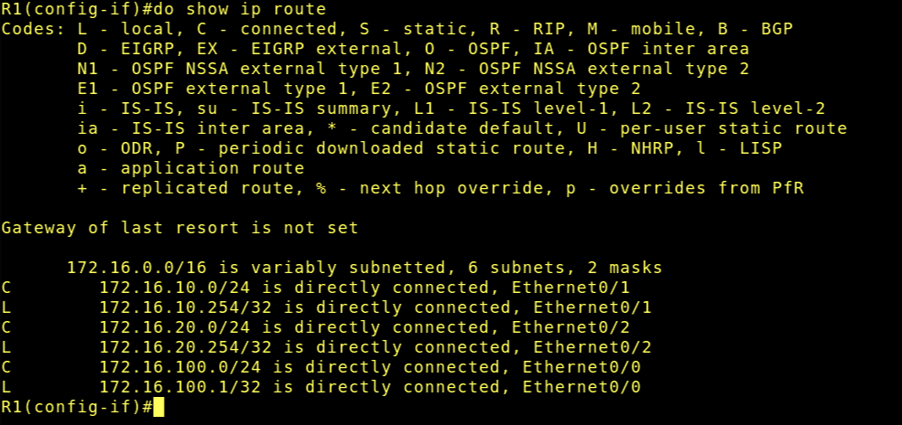

### R2


### R3


## Configuração do RIP

Exemplo de configuração mostrado no roteiro:

```bash
Router-RJ> enable
Router-RJ# configure terminal
Router-RJ(config)# router rip
Router-RJ(config-router)# network 172.16.0.0
Router-RJ(config-router)# end
Router-RJ#

```

> A mesma configuração se aplica para R1, R2, R3. Já que todas as redes que usamos estão na faixa de 172.16.x.x 

## Verificação do RIP

### R1 

- ip route

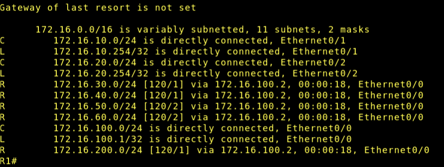

- ip protocols 

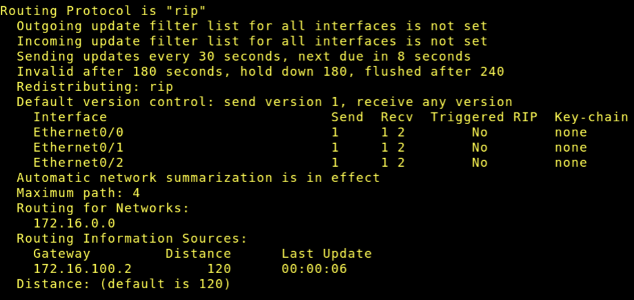

### R2

- ip route

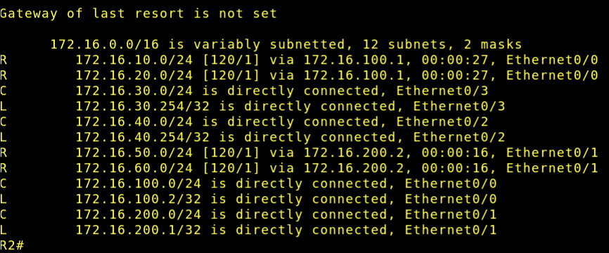

- ip protocols


### R3

- ip route 


- ip protocols

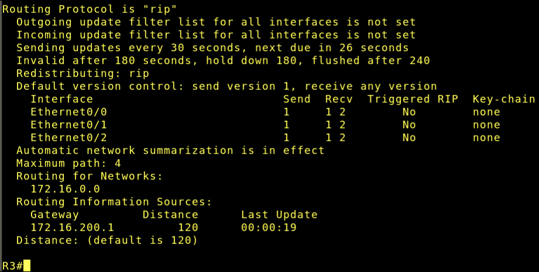

## Configuração do OSPF

Depois da remoção do protocolo RIP, vamos configurar o OSPF da seguinte maneira:

```bash
Router-RJ> enable
Router-RJ# configure terminal
Router-RJ(config)# router ospf 64
Router-RJ(config-router)# network 172.16.10.0 0.0.0.255 area 0
Router-RJ(config-router)# network 172.16.20.0 0.0.0.255 area 0
Router-RJ(config-router)# network 172.16.100.0 0.0.0.255 area 0
Router-RJ(config-router)# end
```

> Usaremos apenas area 0 por se tratar de um laboratório introdutório. A mesma configuração acima é aplicada em R1, R2 e R3, só que para as respectivas redes administradas por cada router.

## Verificação do OSPF

A seguir, mostraremos os seguintes comandos para cada roteador:

```bash
show ip ospf neighbor
show ip route
show ip protocols
```


### R1

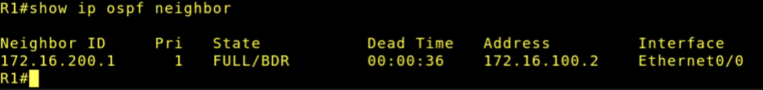

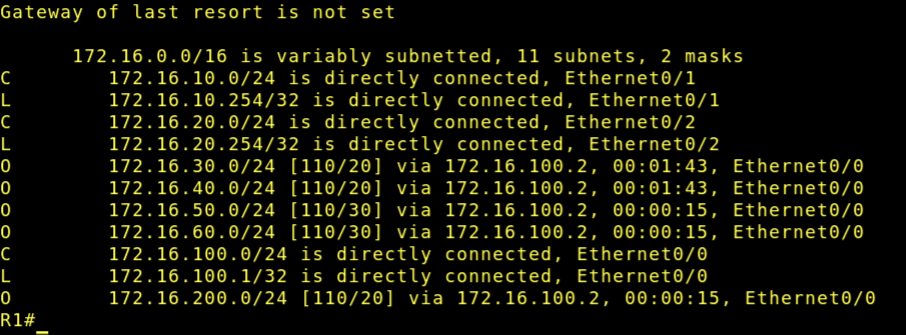

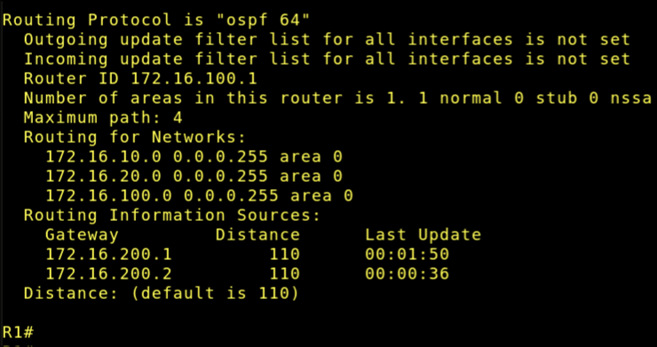

### R2

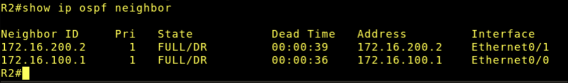


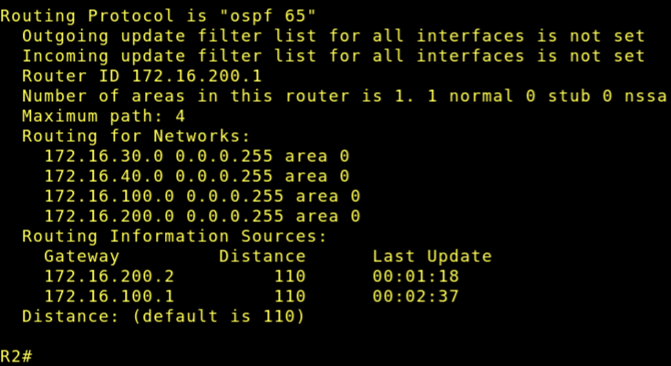

### R3 

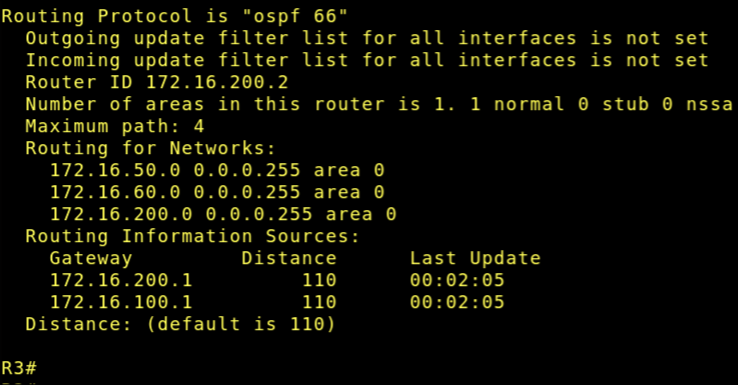

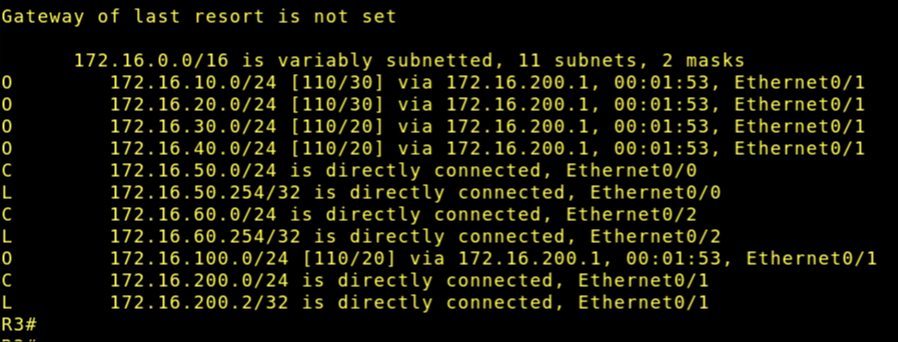


## Comparação orientada entre RIP e OSPF

- Qual protocolo foi mais simples de configurar?

> Com certeza foi o protocolo RIP. Na configuração do RIP apenas anunciamos a nossa rede que queremos que participe da rede RIP.

- Qual protocolo apresentou maior riqueza de informações operacionais?

> Com certeza o protocolo OSPF. Ele tem relações com vizinhança, áreas e até mostra o estado das interfaces. 

- Qual a principal métrica do RIP?

> O número de saltos que o pacote leva para chegar ao destino.

- Qual algoritmo é usado pelo OSPF?

> O OSPF utiliza o algoritmo de Dijkstra para calcular o menor caminho entre o roteador e todas as redes do domínio OSPF, levando em consideração também o custo de cada enlace no roteador.

- Qual protocolo tende a escalar melhor?

> O protocolo OSPF é muito mais escalável pois nos permite dividir a rede em áreas e o cálculo de custo do OSPF é mais complexo do que o RIP que é baseado somente em número de saltos. Também vale ressaltar que o máximo de saltos que o RIP permite é 15, depois disso, o pacote é descartado!

- Qual protocolo converge melhor em cenários maiores?

> O OSPF. o RIP cada vez mais que há roteadores, a convergência se torna muito lenta, levando minutos a uma rede se dar por perdida entre os roteadores, por exemplo. Com o OSPF, todos os roteadores percebem uma queda na rede quase simultaneamente.


## Troubleshooting proposto


### Situação 1 – Remover uma rede do anúncio OSPF em São Paulo

```bash
configure terminal
router ospf 65
 no network 172.16.40.0 0.0.0.255 area 0
end
```

3 segundos depois de eu remover essa rede, realizei um *ping* em um VPC da rede 172.16.10.0/24: 

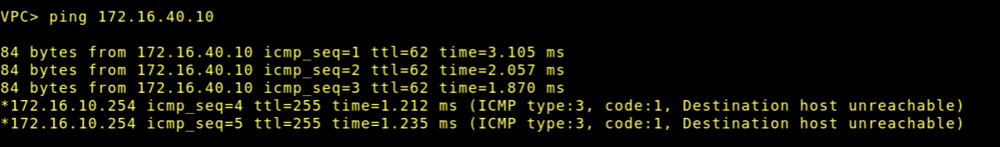

Em menos de 5 segundos já percebemos que a rede caiu.

Também, subindo a rede novamente, fui dar o mesmo ping 3 segundos depois:

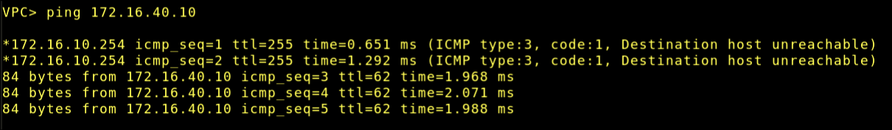

A rede volta a ser anunciada em um período de tempo bem curto.


### Situação 2 – Interromper o enlace SP-BH

```bash
configure terminal
interface e0/1
 shutdown
end
```

IP route de R1 após desligar a rota de BH em SP:


IP route de BH após o ocorrido:

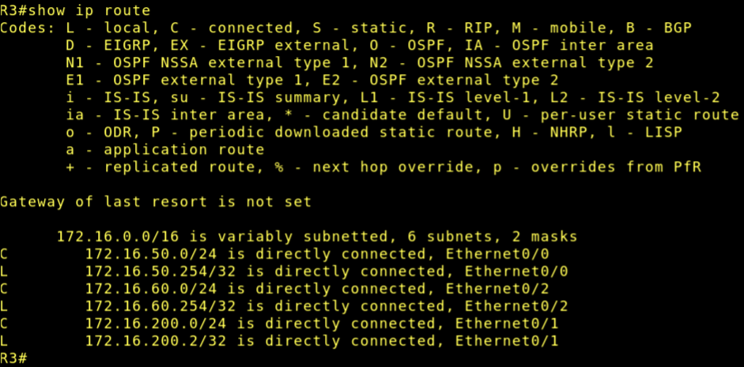

# FIM
