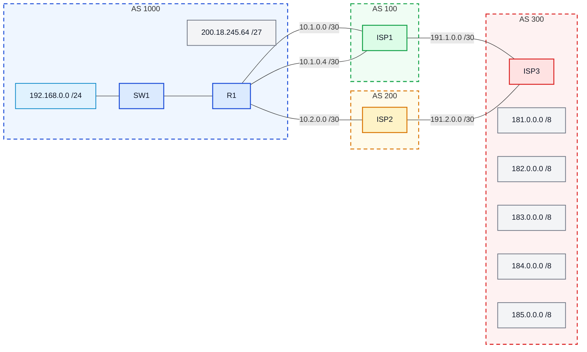
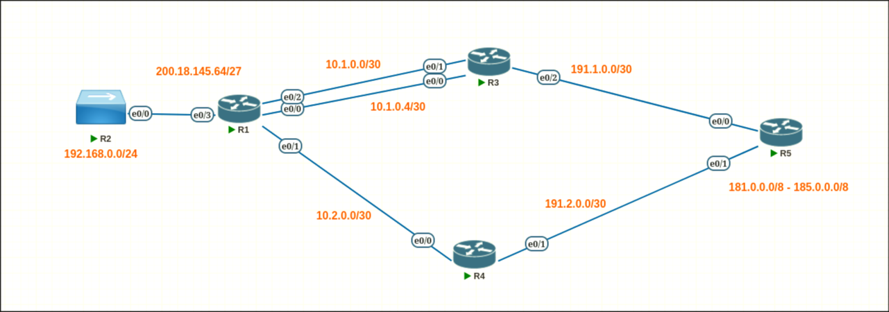
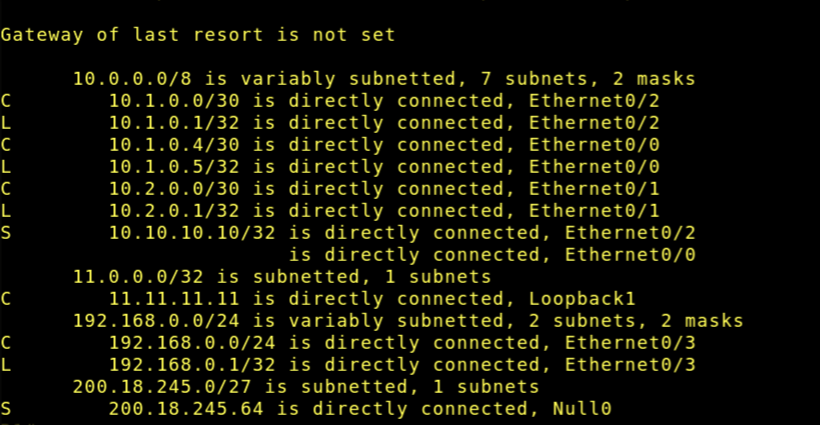
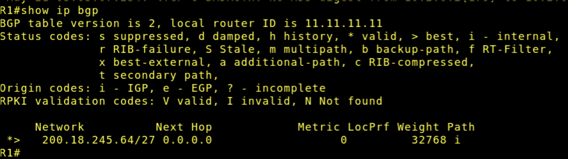
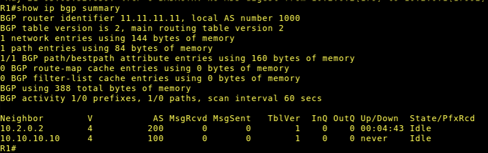
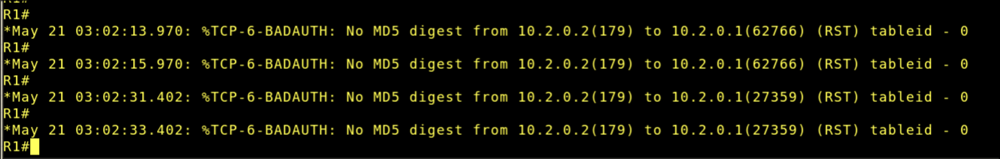

# Laboratório 06 - Roteamento Externo via BGP

## Objetivo

Configurar o protocolo BGP no roteador da empresa para que ela possa anunciar seu prefixo público à Internet por meio de seus provedores.

## Objetivos específicos

- compreender o papel do BGP no roteamento entre sistemas autônomos;
- identificar vizinhanças eBGP;
- configurar o BGP em um roteador de borda corporativo;
- anunciar um prefixo público usando o comando network;
- entender o uso de loopback, update-source e ebgp-multihop;
- verificar a tabela de rotas e a tabela BGP.

## Diagrama lógico

## Topologia

## Verificação

Após a configuração sugerida no roteiro, obtemos:

- ip route

- ip bgp

- ip bgp summary

### Observação importante!

Como não configuramos ISP 1, ISP 2 e ISP 3, não temos o funcionamento completo da rede (a completar no laboratório 7), e também por configurarmos o bgp unidirecionalmente, obtemos o seguinte warning:

> Esse erro se dá pois o roteador do outro lado do enlace não está com a mesma senha que configuramos no BGP de R1

## Questões para análise

- Qual é a função do BGP nesse cenário?

> Anunciar a rede pública *200.18.245.66/27* de R1 para a "internet" por meio de 2 ISPs (ISP 1 e ISP 2).

- Por que a sessão com o ISP1 usa endereço de loopback?

> Porque usar loopback é ótimo para estabilidade na minha infraestrutura. Se usássemos o IP do enlace físico (como em ISP 2 <-> ISP 2), Em um caso hipotético da interface física cair, a comunicação BGP entre os dois componentes simplesmente não funciona mais. Loopback é uma interface virtual que não depende de cabos físicos.

- Por que foi necessário configurar `ebgp-multihop 2`?

> Os pacotes da sessão que chegam a um roteador por padrão tem TTL=1 e eles chegam a interface **física** do dispositivo. Já que estamos utilizando loopback, é necessário que o pacote tenha mais um salto (da física para a virtual) para que o pacote não morra. Então, o comando `ebgp-multihop 2` faz com que o TTL seja igual a 2.

- Qual a função do `update-source Loopback1`?

> Ele faz com que o campo de *IP SOURCE* do roteador seja a da interface virtual (loopback) e não da física. Isso é necessário pois o a outra entidade comunicante (ISP 1, por exemplo) espera que chegue um pacote com *IP SOURCE* igual a interface loopback de R1. Caso contrário, o pacote é descartado.

- Por que foi criada a rota `ip route 200.18.245.64 255.255.255.224 Null0`?

> Porque como não há redes **funcionais** no roteador com essa faixa, nós estamos usando essa rede pública apenas para mostrar o funcionamento do BGP. Encaminhar para Null0 faz com que ela seja descartada assim que um pacote com esse destino chegue e garante que a rede esteja "existente" para que realizemos o laboratório.

- Qual a diferença entre o pareamento com o ISP1 e com o ISP2?

> Com ISP 1, usamos loopback e 2 enlaces de comunicação para mostrar como a utilização de loopback é mais "segura". Com ISP 2 usamos o endereço da interface física diretamente.

# FIM

