# Laboratório 07 - Configuração dos Provedores (BGP Externo)

## Objetivo

Configurar os roteadores ISP1, ISP2 e ISP3 para permitir o funcionamento completo do cenário de BGP externo.

### Este laboratório é uma continuação do [Laboratório 6](../Laboratorio_6/lab6.md), Todo o diagrama lógico está descrito lá. 


## Topologia


## Configuração

Toda a configuração segue quase que completamente o roteiro, mas vou mostrar o *show run* de cada roteador abaixo.

- R1

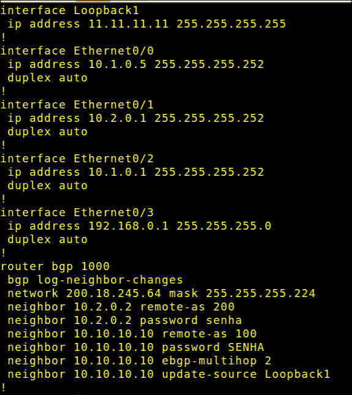

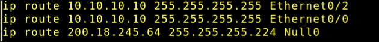

- R4 (ISP 2)

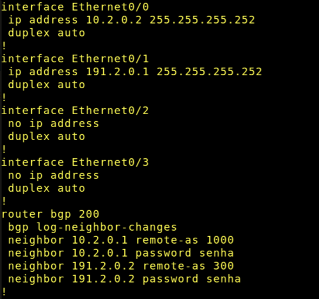

- R3 (ISP 1)

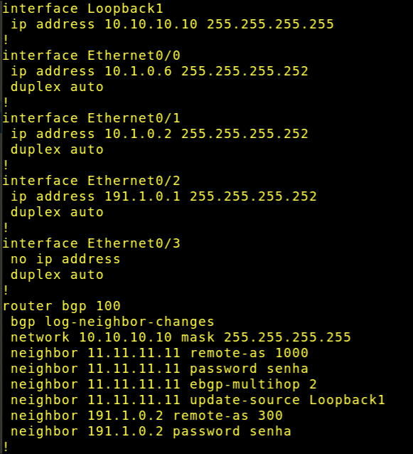

- R5 (ISP 3)

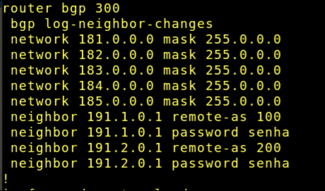

> A configuração das interfaces de R5 segue a mesma do roteiro. Não coloquei pois é grande demais


## Verificação final

Para verificarmos a vizinhança BGP e todas as rotas, usaremos os seguintes comandos:

```
Router# show ip bgp summary

Router# show ip bgp

Router# show ip route

Router# show run
```


- R1 
   - ip bgp
     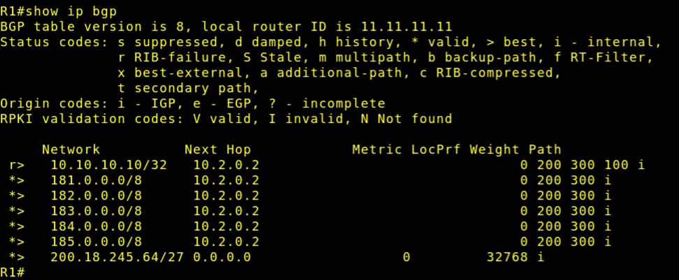
   - ip bgp summary
     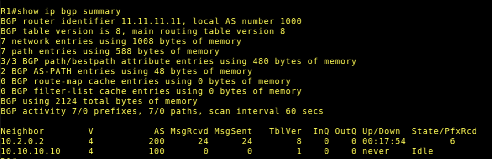
   - ip route
     

- R4
   - ip bgp
     
   - ip bgp summary
     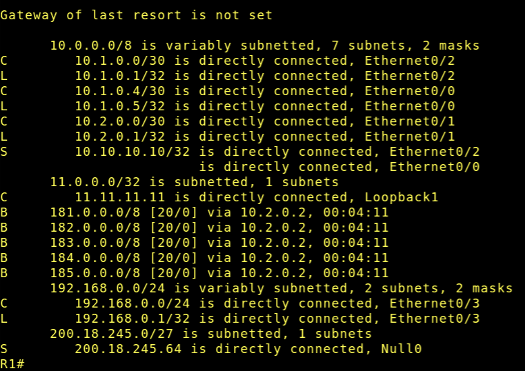
   - ip route
     

- R3
   - ip bgp
     
   - ip bgp summary
     
   - ip route
     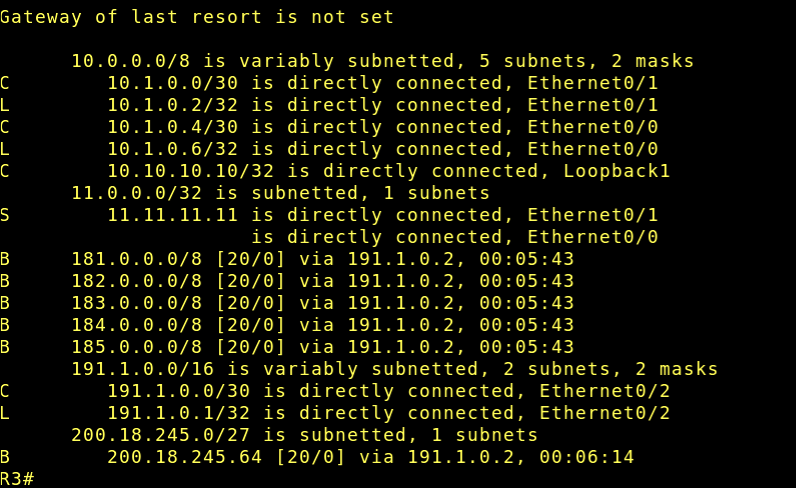

- R5
   - ip bgp
     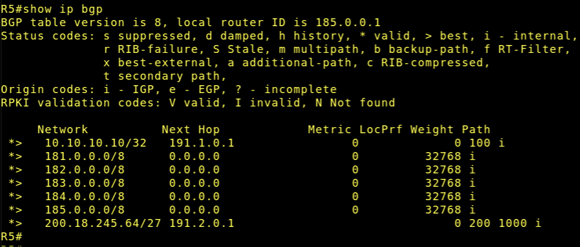
   - ip bgp summary
     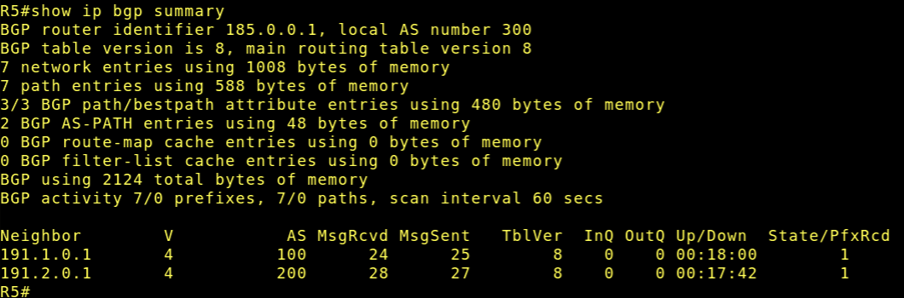
   - ip route
     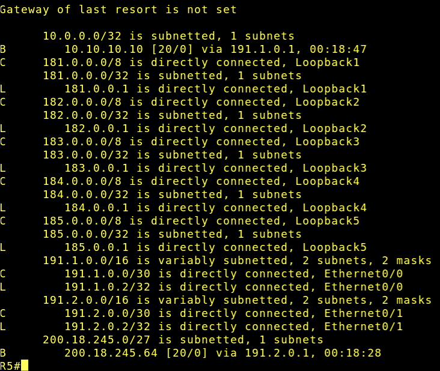

# FIM


