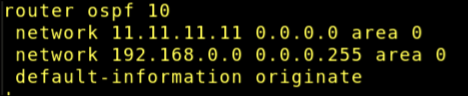
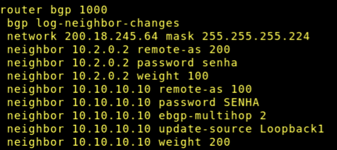
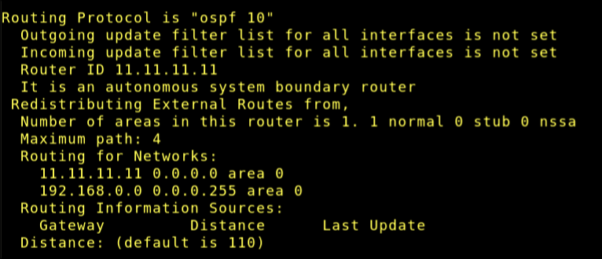
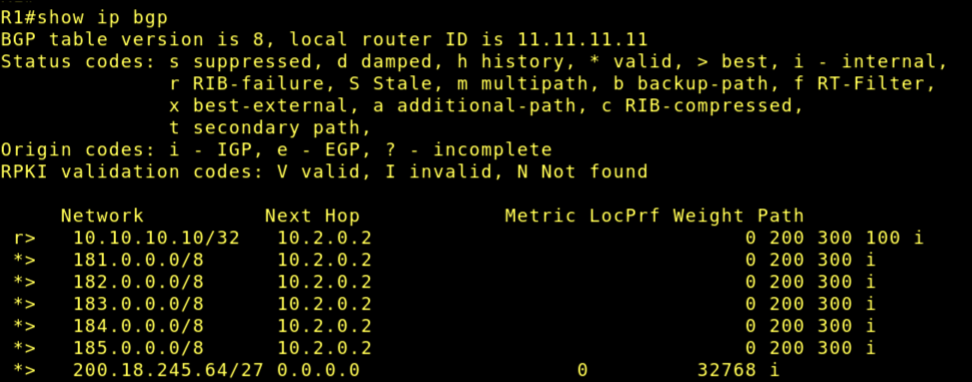

# Lab 08 - Políticas BGP e integração com OSPF

## Objetivo

Aplicar políticas de roteamento BGP e integrar o BGP ao OSPF em um cenário já previamente configurado, realizando apenas os ajustes específicos deste laboratório para anúncio de prefixos, escolha de caminho preferencial de saída, propagação controlada de rota default e análise de redundância entre provedores.

### Este laboratório é uma continuação do [Labotarório 7](../Laboratorio_7/lab7.md).

## Topologia


## Configuração

- Configuração do OSPF em R1:



- Configuração do BGP em R1:



## Integração OSPF - BGP

Como na configuração do OSPF colocamos *default-information originate*, precisamos anexar uma rota default para que o OSPF aprenda-as.


```bash
R1> enable

R1# configure terminal

R1(config)# ip route 0.0.0.0 0.0.0.0 10.10.10.10

R1(config)# end
```

## Verificação

- IP protocols -> OSPF


- IP protocols -> BGP



- IP bgp


- IP bgp summary



- IP OSPF


## Questões para análise

- Qual é o papel do OSPF neste laboratório?

> O OSPF serve para administrar as rotas na rede local de R1.

- Qual é o papel do BGP neste laboratório?

> Conversar com os outros provedores da rede externa, também anúncia a rede pública para eles.

- Por que o bloco 200.18.245.64/27 é anunciado externamente, mas a rede 192.168.0.0/24 não?

> Porque o primeiro bloco é a rede pública anunciada *publicamente* para os outros AS, a rede privada não é pois ela não é roteável por ser do tipo privada.

- 4. Qual a vantagem de formar a sessão BGP com o ISP1 por loopback?

> Usar loopback tira a necessidade de usar o endereço do link físico do roteador. Caso o link físico caia, o loopback ainda vai conseguir administrar pois ele é uma interface virtual.

- Qual é a função do comando update-source Loopback1?

> Permite que o BGP use o endereço de loopback e não o endereço do link físico.

- Qual é a função do comando ebgp-multihop 2?

> Faz com que o TTL do pacote seja de 2 ao invés de 1. Pois o pacote chega na interface física e depois vai para a virtual (loopback).

- Como verificar, no show ip bgp, qual ISP está sendo preferido?

> Identifica-se o caminho preferido por causa do ">" acompanhado. No print, apenas mostra o HOP do ISP2 porque por mais que a configuração foi seguida no laboratório, ISP1 não consegue ser reconhecido no R1. Talvez seja erro do roteador...

- Por que é mais adequado propagar apenas a default route no OSPF?

> Pois evita que vários prefixos conhecidos pelo BGP sejam anexados ao OSPF. 

- O que acontece quando o enlace principal com o ISP1 falha?

> A sessão continuaria ativa (caso um enlace caísse) pois o ISP1 usa seu endereço de loopback. Caso todas caiam, a única rota usada seria para ISP2.

- Qual a diferença entre usar OSPF para a rede interna e BGP para a borda?

> OSFP é IGP, muito bom para administrar redes internas. Já o BGP é EGP e é melhor para troca de informações entre provedores.

# FIM
