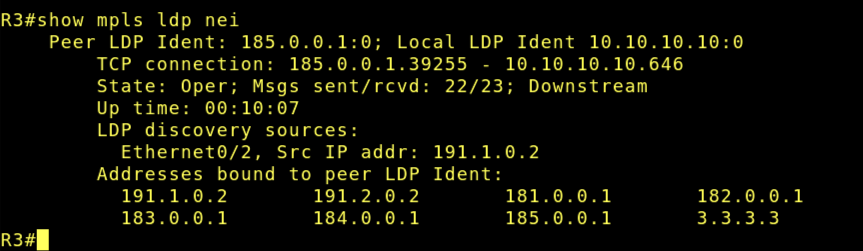
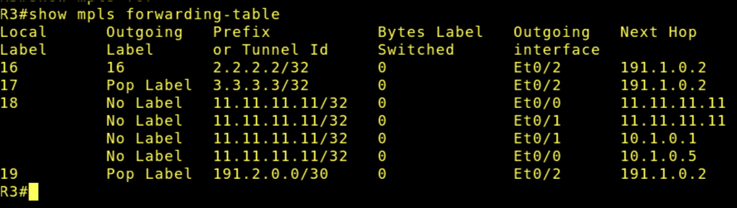
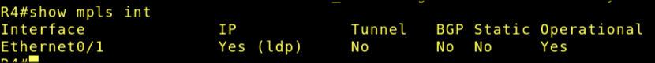
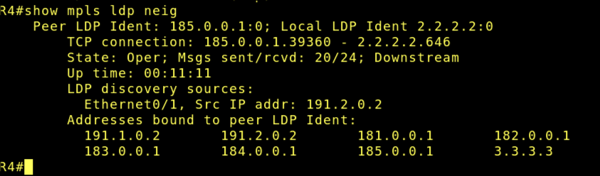
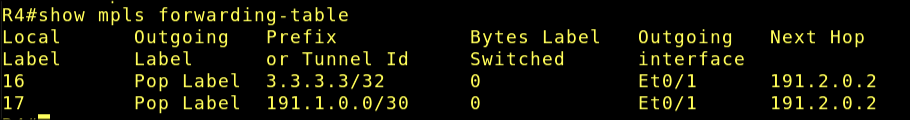
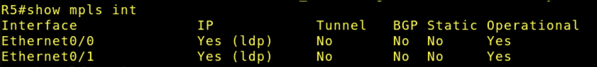
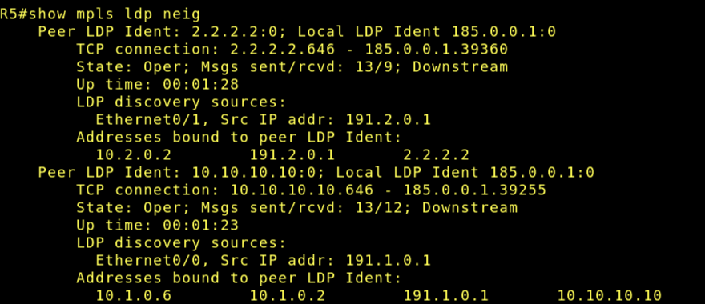
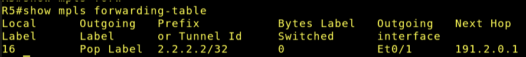

# Lab 09 - Implementação de MPLS no Backbone

Este laboratório é uma continuação do [Laboratório 8](../Laboratorio_8/lab8.md)

## Objetivo

Implementar um backbone MPLS simplificado na rede do provedor, dando continuidade ao Lab 08, de modo a compreender o papel dos roteadores CE, PE e P, habilitar o transporte por rótulos no núcleo da operadora e verificar o funcionamento do backbone MPLS sobre uma infraestrutura previamente estabelecida com OSPF e BGP.

## Configuração

Como ISP 1 já tinha endereço loopback, criei apenas do ISP 2 e adicionei mais um em ISP 3.

Toda a configuração do MPLS segue a mesma mostrada no roteiro.

## Verificação

- ISP 1

Show mpls interfaces

Show mpls ldp neighbor

Show mpls forwarding-table

- ISP 3

Show mpls interfaces

Show mpls ldp neighbor

Show mpls forwarding-table

- ISP 3

Show mpls interfaces

Show mpls ldp neighbor

Show mpls forwarding-table

## Questões para análise

- Qual é a principal diferença entre roteamento IP tradicional e encaminhamento com MPLS?

> No roteamento IP, temos o endereço IP de destino no header do pacote. No MPLS, cada roteador vai ter uma tag para conversar com os outros roteadores que também utilizam MPLS. 

- Qual é a função do OSPF dentro do backbone do provedor?

> Permitir que todos os roteadores do backbone tenham conectividade. Pois o OSPF é um IGP. 

- Qual é o papel dos roteadores PE?

> Estes são responsáveis por integrar a "bolha" MPLS com o externo (cliente). Ele recebe pacotes IP do cliente e cola a TAG MPLS para passar por dentro do nosso backbone. E para que o pacote saia do backbone e vá para o externo, ele tira a TAG MPLS e deixa apenas como IP normal.

- Qual é o papel do roteador P?

> Apenas trabalha repassando as TAGS dentro do nosso backbone. ELe não tem conhecimento do "mundo externo" (cliente). Ou seja, apenas trabalha com MPLS.

- Por que o cliente normalmente não precisa configurar MPLS no seu roteador?

> Tem menos custo operacional, menos complexidade para o lado do cliente. Geralmente o MPLS fica a cargo para o backbone da empresa.

- Como o Lab 09 complementa o Lab 08?

> Enquanto nos laboratórios passados configuramos o BGP e o OSPF apenas para R1, neste laboratório determinamos as rotas de dentro do nosso backbone (ISP1, ISP2 e ISP3) para que eles consigam passar pacotes MPLS entre si para maior eficiência da rede. E então, usamos OSPF entre os ISPs para atualizarmos a RIB de cada ISP e assim fazer com que o MPLS atue corretamente.

- O que significa dizer que o MPLS atua como tecnologia de “camada 2,5”?

> Ele não é protocolo de roteamento mas depende da RIB para funcionar. E o cabeçalho do MPLS é inserido entre camada 2 e 3. Também ele não usa frame nem toma decisões com base no IP. Usa somente as TAGs para comunicação.

- Por que o backbone precisa de um IGP estável antes da ativação do MPLS?

> Como ele usa a RIB, ele precisa saber também o melhor caminho para alcançar cada dispositivo a fim de associá-lo a uma TAG e ter conectividade para a troca de pacotes dentro da rede MPLS.

# FIM
